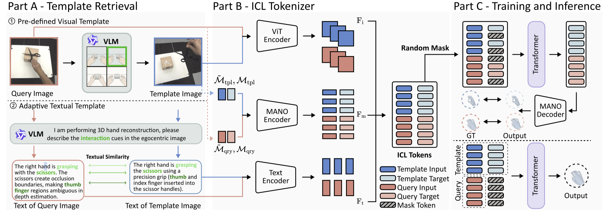

# EgoHandICL: Egocentric 3D Hand Reconstruction via In-Context Learning

[](https://arxiv.org/abs/2601.19850)
[](https://huggingface.co/datasets/Nicous/EgoHandICL/tree/main)

Official implementation of **EgoHandICL** (ICLR 2026).

## Table of Contents

- [News](#news)
- [Overview](#overview)
- [Installation](#installation)
- [Training](#training)
- [Inference](#inference)
- [Evaluation](#evaluation)
- [Citation](#citation)

---

## News

- **2026-01:** EgoHandICL released with paper, dataset, and checkpoint support.

---

## Overview

**EgoHandICL** targets **egocentric 3D hand reconstruction** by leveraging **in-context learning**.  

<p align="center">
  
</p>

<p align="center">
  
</p>


---

## Installation

```bash
git clone https://github.com/<YOUR_ORG>/EgoHandICL.git
cd EgoHandICL
pip install -r requirement.txt
```

Download the data from the huggingface and organize your local directory roughly like this:

```bash
<data_root>/
  fulldata/
  mano_gt/
  mano_wilor/
  mano_hamer/
  ... (other assets used by your pipeline)

```

## Training
Train EgoHandICL with the full training script:
```bash
python -m handicl.train \
  --data_root /fulldata/ \
  --run_name icl_run_1\
  --save_dir checkpoints/iclr_run_1 \
  --json_path train_list.json \
  --batch_size 64 \
  --hidden_dim 128 \
  --num_heads 4
```

## Inference
```bash
python egohandicl_infer_new.py \
  --data_root /fulldata \
  --ckp_path /checkpoints/icl_arctic.pth \
  --json_path test_list.json \
  --hidden_dim 128 \
  --num_heads 4
```

Key Arguments:
- --data_root: root folder containing dataset assets.
- --ckp_path: model checkpoint file.
- --json_path: json list defining the evaluation samples.
- --hidden_dim, --num_heads: model hyperparameters (must match the checkpoint).

## Evaluation

Evaluate predictions using MANO GT + baseline MANO predictions:
```bash
python eval.py \
  --img_dir image.json \
  --mano_gt_dir fulldata/mano_gt \
```

# Citation
If you use EgoHandICL in your work, please cite:

```bibtex
@misc{xie2026egohandicl,
      title={EgoHandICL: Egocentric 3D Hand Reconstruction with In-Context Learning}, 
      author={Binzhu Xie and Shi Qiu and Sicheng Zhang and Yinqiao Wang and Hao Xu and Muzammal Naseer and Chi-Wing Fu and Pheng-Ann Heng},
      year={2026},
      eprint={2601.19850},
      archivePrefix={arXiv},
      primaryClass={cs.CV},
      url={https://arxiv.org/abs/2601.19850}, 
}
